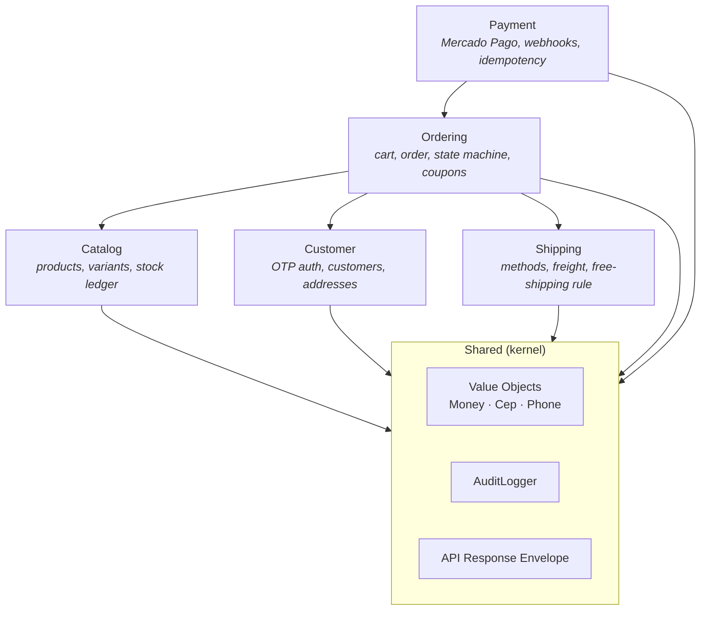

# Context map

The bounded contexts and how they relate. Arrows indicate dependency direction
(a context that uses another's published concepts points at it). `Shared` is a kernel
used by all.

## Reading the map

- **Ordering** is the hub: a cart/order references catalog variants, a customer, and a
  chosen shipping method.
- **Payment** reacts to an order and, on confirmation, drives the order's state
  forward and the stock decrement (see the order → payment → stock flow).
- **Catalog** owns the stock ledger; other contexts request reservations/decrements
  through its published application services, never by writing to its tables.
- **Shared** holds only truly cross-cutting concerns. It depends on nothing.
