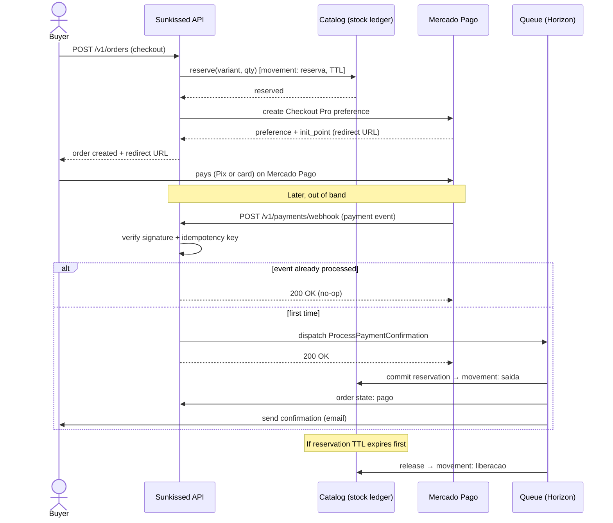

# Flow: order → payment → stock

The core asynchronous flow. The key idea (ADR-0005): checkout only **reserves** stock;
the **confirmed-payment webhook** is what commits the sale and decrements stock. The
webhook is idempotent.

## Notes

- **Reservation TTL**: a scheduled job releases reservations whose TTL passed without
  a confirmed payment (`STOCK_RESERVATION_TTL_MINUTES`).
- **Idempotency**: the webhook records processed event ids; a duplicate delivery is a
  no-op, so stock is decremented exactly once and the state machine transitions once.
- **State machine**: `aguardando_pagamento → pago → em_preparacao →
  a_caminho | pronto_para_retirada → concluido` (with `cancelado` / `expirado` paths).
  Only valid transitions are allowed.
- **Why a queue**: the webhook returns 200 fast; the actual work (stock commit,
  notifications, audit archive write) runs asynchronously via Horizon.
